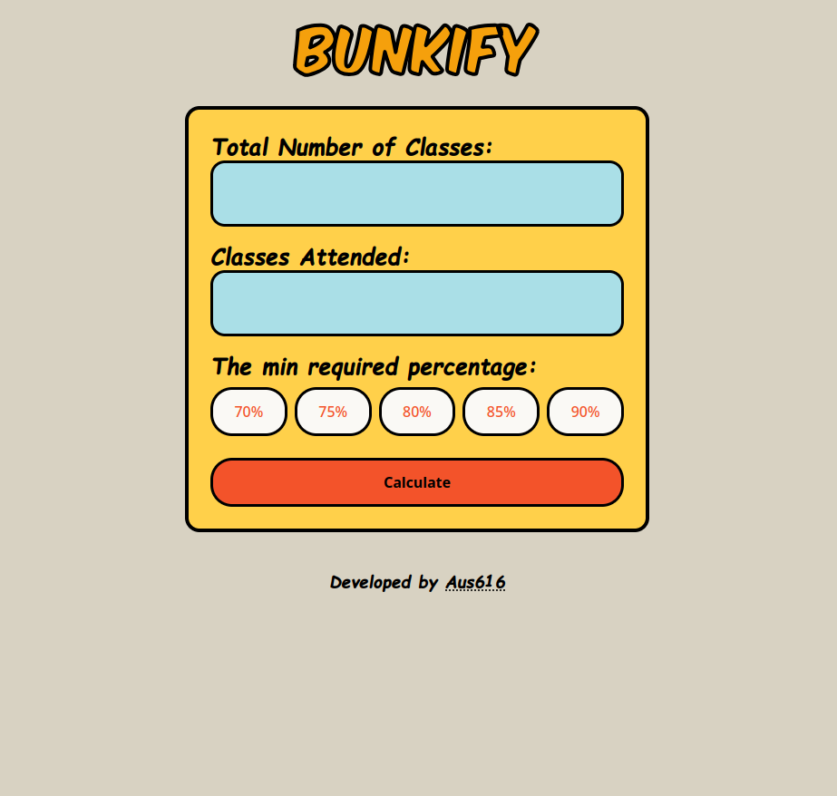
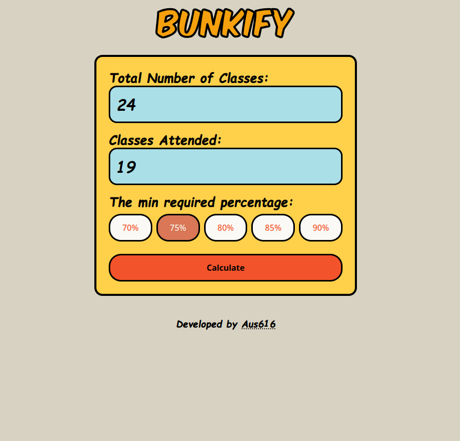
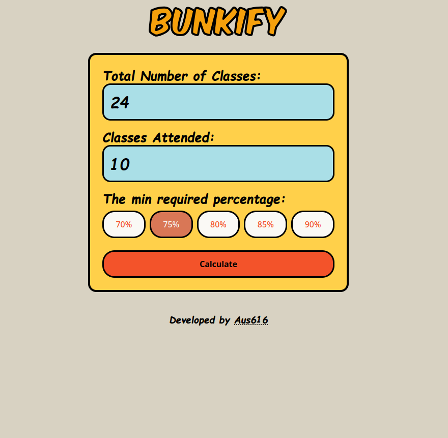
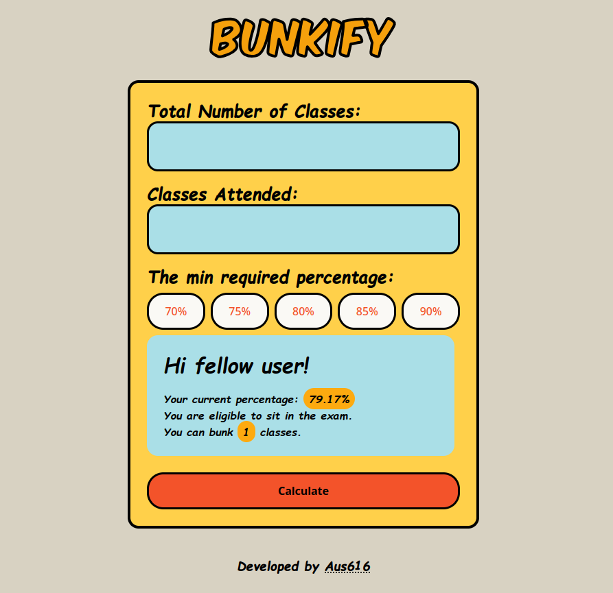
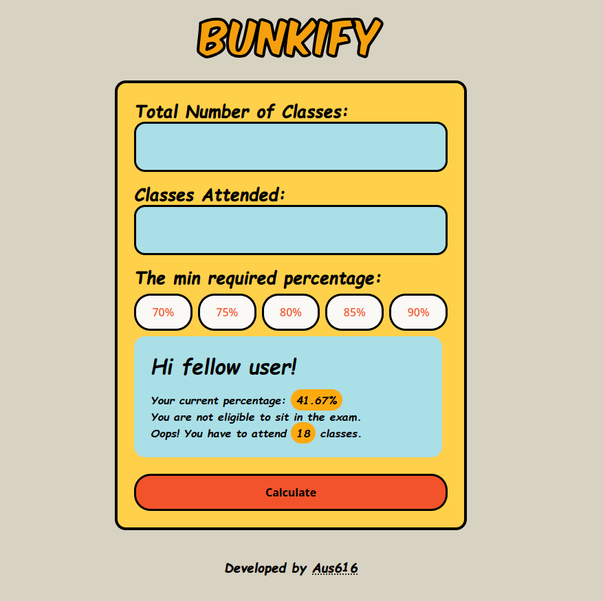

# Bunkify 🎓

Bunkify is a fun, user-friendly web app that helps students calculate the number of classes they can bunk while maintaining a specific attendance percentage.


##  Features

- Simple input fields for total and attended classes.
- Interactive percentage buttons to set attendance thresholds (70%, 75%, 80%, etc.).
- Real-time calculation of permissible bunks based on the entered data.

---

##  Screenshots

### Home Screen:


### Input Classes:
Case1:

<br>
Case2:



### Bunk Calculation Result:
Case1:

Case2:

## 🛠 Installation
1. **Clone the Repository**:
   ```bash
   git clone https://github.com/yourusername/bunkify.git 
2. **Navigate to the Project Directory:**
    ```bash
   cd Bunkify 
3. **Create & activate the Virtual Environment:**
   ```bash
          python3 -m venv venv
          source venv/bin/activate  # On Windows use `venv\Scripts\activate`       

7. **Install Dependencies:**
   ```bash
         pip install -r requirements.txt
9. **Run the Application :**
    ```bash
          flask --app app run
